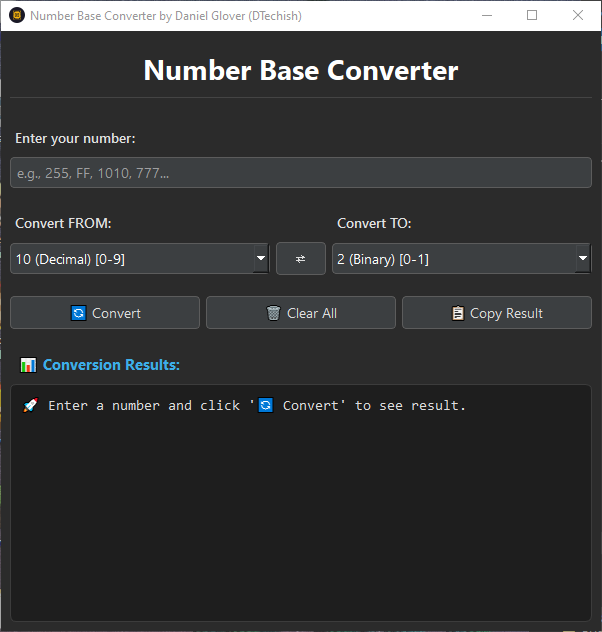
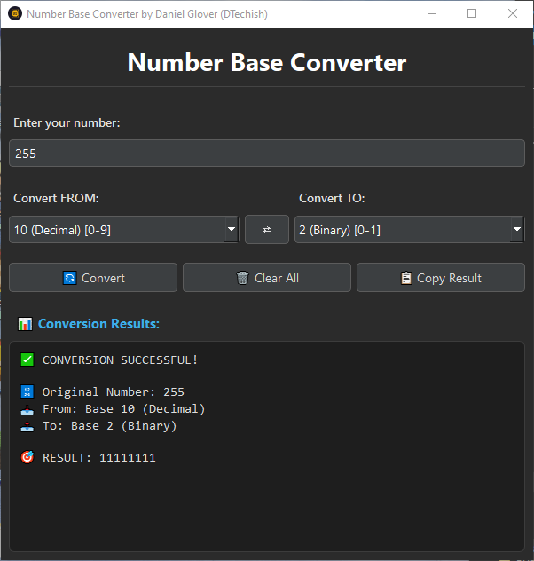
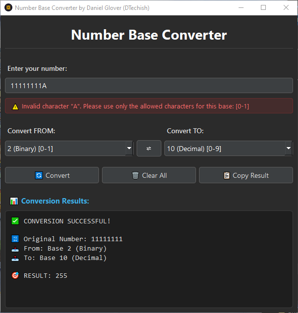

# Number Base Converter

A user-friendly GUI application that converts numbers between any bases from 2 to 36, built with Python and PySide6.

## 🚀 Features

- **Universal Base Conversion**: Convert between any number bases (2-36)
- **Clean Interface**: Intuitive GUI with clear input/output sections
- **Smart Validation**: Real-time input validation with helpful error messages
- **Quick Actions**: 
  - Swap conversion directions with one click
  - Copy results to clipboard
  - Clear all fields instantly
- **Comprehensive Base Names**: Shows both numeric and traditional names (e.g., "16 (Hexadecimal)")
- **Character Range Display**: Shows valid characters for each base

## 📥 Download & Run

### Windows Users (Recommended)
1. Go to [Releases](../../releases)
2. Download the latest `.exe` file
3. Double-click to run - no installation needed!

### Python Users
1. Clone this repository
2. Install dependencies: `pip install -r requirements.txt`
3. Run: `python base_converter.py`

## 🖼️ Screenshots







## 🎯 How to Use

1. **Enter your number** in the input field
2. **Select the source base** (what base your number is currently in)
3. **Select the target base** (what base you want to convert to)
4. **Click Convert** or press Enter
5. **Copy the result** or perform another conversion!

### Example Conversions
- `255` (Decimal) → `FF` (Hexadecimal)
- `1010` (Binary) → `10` (Decimal)
- `777` (Octal) → `511` (Decimal)
- `ABC` (Hexadecimal) → `2748` (Decimal)

## 🔧 Supported Bases

| Base | Name | Characters |
|------|------|------------|
| 2 | Binary | 0-1 |
| 8 | Octal | 0-7 |
| 10 | Decimal | 0-9 |
| 16 | Hexadecimal | 0-9, A-F |
| 36 | Hexatrigesimal | 0-9, A-Z |
| ... | *All bases 2-36* | *And everything in between* |

## 🛠️ Technical Details

- **Language**: Python 3.8+
- **GUI Framework**: PySide6 (Qt for Python)
- **Packaging**: PyInstaller for executable creation
- **Image Processing**: Pillow (for icon handling and conversion)
- **Styling**: Custom QSS stylesheet for modern UI

## 📋 Requirements

- Python 3.8 or higher
- PySide6 6.4.0 or higher
- Pillow 11.3.0 or higher

## 🏗️ Building from Source

### For Development
```bash
git clone https://github.com/yourusername/number-base-converter.git
cd number-base-converter
pip install -r requirements.txt
python base_converter.py
```

### Creating Executable
```bash
pip install pyinstaller
pyinstaller --onefile --windowed --add-data "styles.qss;." --add-data "icon.png;." --icon="icon.png" base_converter.py
```

## 👨‍💻 Author

Created by Daniel Glover (DTechish)

## 🙏 Acknowledgments

- Built with [PySide6](https://doc.qt.io/qtforpython/) - Qt for Python
- Packaged with [PyInstaller](https://pyinstaller.org/)
- Inspired by the need for a simple, comprehensive base converter

---

